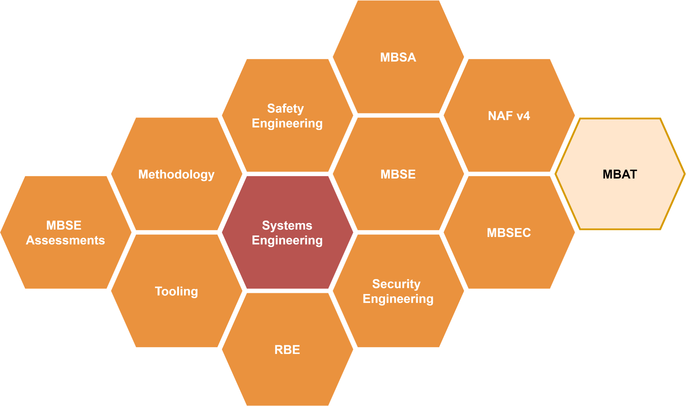
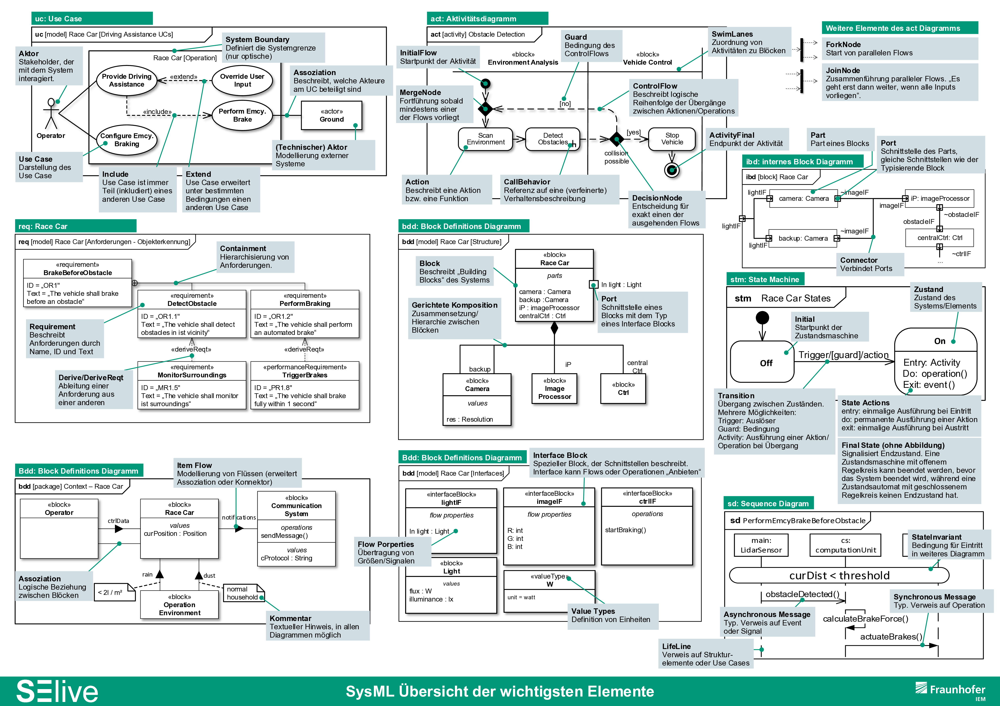

# Systems Engineering (SE)

# Requirements Based Engineering (RE)

## Grundlegende Prinzipien

## Stakeholder Requirements

## System Requirements

## Requirements Compliance

## Requirements schreiben

## Verlinken & attributieren von Requirements

## Verifikation & Validierung von Requirements

::: {callout-note}
Verifizierung oder Verifikation (von lateinisch veritas ‚Wahrheit‘ und facere ‚machen‘) ist der Nachweis, dass ein
vermuteter oder behaupteter Sachverhalt wahr ist.
:::

::: {callout-note}
Validierung oder Validation (von lateinisch validus "kräftig, wirksam, fest")

* Validierung (Chipentwurf), Vergleich des Chipdesigns mit der vorgegebenen Spezifikation
	
* Validierung (Informatik), Nachweisführung, dass ein System die Praxisanforderungen erfüllt
:::

# Model-Based Systems Engineering (MBSE)

## SysML als Basis für MBSE

## Diagramme der SysML

## Alternative MBSE-Sprachen

## Tooling

# Methodiken und Prozesse

## MBSE Assessment

## MBSE Prozess

## MBSA - Model Based Safety Analysis

## MBAT - Model Based Analysis and Testing

## MBSec - Model Based Security
