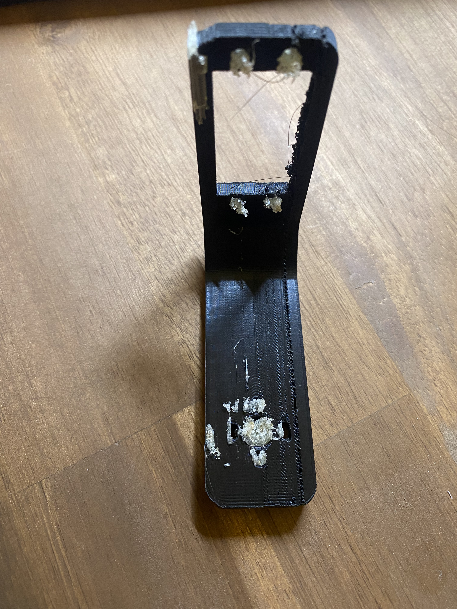

# 3D Druck des Gimbal

## Einführung

Zur erstellung der selbst stabilisierenden Platform, werden die verschiedenen Bauteile des Gimbals mittels 3D Druck erstellt. Diese umfassen das Gehäuse des Microcontrollers, die Platform für die Kamera, sowie die Halter für die Servo-Motoren. 

Um einen erfolgreichen 3D-Druck zu gewährleisten, werden die hierfür vorgesehenen 3D-Druckdateien in fünf Grundstrukturen unterteilt. Die Aufteilung basiert auf der Kameraplattform, den drei Servomotoren - die jeweils eine Achse der Stabilisierung steuern - und dem Verschlussdeckel für das Gehäuse des Microcontrollers.

Dadurch erhält man eine STL-Datei als erste Grundstruktur _(Base 01)_ für den Servomotor, der die Yaw-Drehung steuert, also die Drehung um die z-Achse als Referenzsystem. Eine weiere Grundstruktur _(Base 02)_ ist für den Servomotor, der die Roll-Drehung steuert, was sich auf die x-Achse bezieht. Die dritte Grundstruktur _(Base 03)_ ist für den Pitch-Servomotor, der eine Anpassung in Bezug auf die y-Achse vornimmt. Es ist wichtig zu beachten, dass die Grundstruktur für die Yaw-Anpassung auch als Gehäuse für den Microcontroller dient.

Die folgende Abbildung zeigt die zusammengesetzte Grundstruktur des Gimbals, einschließlich der Servomotoren.


<!---
Dont know how to fix - yet

```{image} ../images/Gimbal_Platform.png
:alt: Platform
:class: bg-primary mb-1
:width: 250px
:align: center
```

-->

-------------
## CAD Modellierung

Mit Fusion 360 und Inventor kann man diese 3D-Entwürfe erstellen. Die Programme bieten außerdem die möglichkeit in teams zusammenzuarbeiten, Daten zu verwalten und Simulationen auszuführen, um dadurch Konstruktionen im vorfeld zu validieren.

In unserem Projekt verwenden wir Inventor als CAD-Programm, jedoch besteht die Möglichkeit, das bevorzugte CAD-Programm zur Bearbeitung zu nutzen. Die entsprechenden Inventor-Dateien befinden sich im Ordner _"3d_druck_gimbal"_ und können nach Belieben in andere Formate umgewandelt werden.

__Autodesk Fusion 360__, sowie __Autodesk Inventor__ besitzten eine _kostenlose_ "Campus" Version, welche Kostenlos für Lehrende und Studenten ist. 

Sie unterstützen folgende 3D Druck formate:

| STL(Binär) | STL(ASCII) | 
| :----:     |      :----:|
|         3MF|         OBJ| 

und sind erhältlich über folgenden link: [_Fusion-Download/Inventor-Download_](https://www.autodesk.de/education/edu-software/overview?sorting=featured&filters=individual) 
</br></br>

------------
# Erster Druck
Vor der CAD-Modellierung wurde zunächst ein initialer Testdruck durchgeführt, um zu überprüfen, ob die vorhandenen STL-Dateien für unseren Drucker geeignet sind. Je nach verwendetem Drucker können spezifische Anpassungen erforderlich sein.

Im Folgenden wird der erste Druck basierend auf dem Modell "Base 02" dargestellt. Dieses Beispiel verdeutlicht die Bedeutung eines ersten Testdrucks, da die gedruckte Struktur nicht ideal ist. Es traten Probleme mit der Stabilität aufgrund der gewählten Dichteinstellungen sowie mit den Stützstrukturen auf, die verwendet wurden, um das Einkrachen des Drucks in den Löchern zu verhindern. Das verwendete Stützmaterial war zu fest und konnte nicht ordnungsgemäß entfernt werden.



Diese Probleme wurden dokumentiert, und ein zweiter Druck wurde gestartet, um den Gimbal vollständig zusammenzubauen und anschließend erneut zu bewerten, welche Anpassungen erforderlich sind.

## Zweiter Druck
Der zweite Druck war erfolgreich, da verschiedene Faktoren wie das Stützmaterial und die Druckdichte angepasst wurden. Zudem wurde der Druck über einen längeren Zeitraum durchgeführt, um die Stabilität sicherzustellen. Es wurden stabile Bauteile hergestellt, die verwendet werden können, um den Gimbal vollständig zusammenzubauen.

## Finale Anpassungen
Nachdem der Gimbal zusammengebaut war, stellte sich heraus, dass weitere Anpassungen in der CAD-Modellierung erforderlich sind. Wie auf der folgenden Abbildung zu sehen ist, passten nicht alle Kabel aufgrund der Kabelführung. Darüber hinaus traten geringfügige Abweichungen bei den Schraubenlöchern auf, die angepasst werden mussten, um eine feste Verbindung der Schrauben zu gewährleisten.


Bevor diese Anpassungen gedruckt wurden, wurde der erste Prototyp evaluiert. Dabei wurde festgestellt, dass es sinnvoll ist, eine Bananenbuchse in den Gimbal zu integrieren. Diese Buchsen ermöglichen die Anwendung einer konstanten Spannung am Gimbal, was es ermöglicht, den Gimbal in Zukunft mit einem HIL-fähigen System zu verbinden und weitere Tests durchzuführen.

Die finalen Anpassungen werden in Autodesk Inventor umgesetzt. Die aktualisierten STL-Dateien sind im Ordner "3d_druck_gimbal/Inventor_files/Finaler_Druck" zu finden.

## Zusammengebauter Gimbal