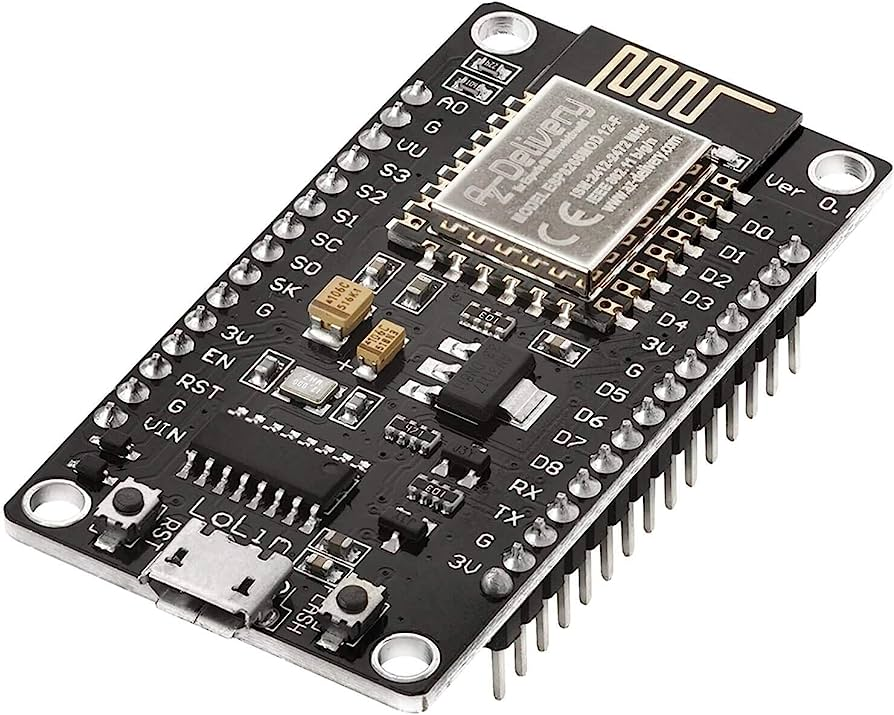

# Elektronik des Gimbal

## Einführung
Um die Elektronik des Gimbals zu implementieren, d.h. der Servomotor lenkt in die entgegengesetzte Richtung aus, wenn sich die Position des Objekts ändert, um eine Position des Objekts zu erreichen, die sich nicht mit dem Gimbal verändert. 

In diesem Abschnitt werden verschiedene Chiptypen (Arduino Nano und ESP8266) und drei-Achsen-Positionssensor (MPU650) zur Steuerung der Servomotoren verwendet. Der Steuercode wird in die verschiedenen Chiptypen geschrieben und der Sensor wird über Kabel mit den Chips verbunden. Um den ordnungsgemäßen Betrieb des Sensors zu gewährleisten, wird die Spannung der Batterie über den Buckconverter so eingestellt, dass an beiden Enden des Sensors die richtige Spannung anliegt.

Die wichtigsten Schritte sind wie folgt:
Auswahl der Chips: Für die Steuerung des Servomotors werden verschiedene Chiptypen verwendet. Zu diesen Chips gehören der Arduino Nano und der ESP8266, die beide über zahlreiche Funktionen verfügen und gut kompatibel sind.

Sensoranschluss: Der MPU650-Sensor wird über ein Kabel mit dem Chip verbunden. Die Hauptfunktion des Sensors ist es, genaue 3-Achsen-Lage- und Bewegungsdaten für die präzise Steuerung des Servomotors zu liefern.

Leistungsanpassung: Um den korrekten Betrieb des Sensors sicherzustellen, wird die Batteriespannung mit einem Buckconverter angepasst. Dadurch wird sichergestellt, dass der Sensor innerhalb des geeigneten Spannungsbereichs arbeitet, um genaue Daten zu liefern.

Schreiben des Steuercodes: Der für die Steuerung des Servomotors erforderliche Code wird in die verschiedenen Chiptypen geschrieben. Durch das Schreiben des entsprechenden Codes können die Position und die Bewegung des Servomotors auf der Grundlage der vom Sensor gelieferten Daten gesteuert werden.

Motoranschluss: Schließlich wird der Servomotor über ein Kabel an den Chip angeschlossen. Dadurch kann der Chip Steuersignale an den Motor senden, was eine präzise Steuerung des Servomotors ermöglicht.

Der spezifische Schaltplan sieht wie folgt aus:


## Arduino Nano
Der Arduino Nano ist ein Open-Source-Breadboard-Mikrocontroller-Board, das auf dem Microchip ATmega328P-Mikrocontroller basiert. Der Arduino Nano kann mit der integrierten Entwicklungsumgebung (IDE) der Arduino-Software programmiert werden, die für alle Arduino-Boards gleich ist und sowohl online als auch offline läuft. 


## Arduino Code Beschreibung

Um die Gimbal-Funktionalität mit dem Nano-Chip zu implementieren, muss der Code kompiliert und in die Arduino-Software hochgeladen werden. Der Code ist im Ordner arduino_gimbal zu finden. Bevor dieser Code verwendet werden kann, ist es wichtig, die grundlegende Funktionalität des Codes zu verstehen. Während des gesamten Prozesses muss der Code Sensordaten vom MPU6050-Sensor lesen und diese Daten zur Steuerung des Servos verwenden. Es werden bestimmte Pins definiert und die Servos an diese Pins angeschlossen. 
</br>
1,Der Interrupt-Pin wird auf Pin 2 festgelegt. 
</br>
2,Der Servo servo0 wird an Pin 10 angeschlossen.
</br>
3,Der Servo servo1 wird an Pin 9 angeschlossen.
</br>
4,Der Servo servo2 wird an Pin 8 angeschlossen.
</br>

```cpp
#define OUTPUT_READABLE_YAWPITCHROLL
#define INTERRUPT_PIN 2  
  servo0.attach(10);
  servo1.attach(9);
  servo2.attach(8);
```

Die Aufgabe eines Interrupts ist es, dafür zu sorgen, dass der Prozessor schnell auf wichtige Ereignisse reagiert. Wenn ein bestimmtes Signal erkannt wird, unterbricht ein Interrupt die Arbeit des Prozessors und führt einen Code aus, der auf den externen Stimulus reagiert, der dem Arduino zugeführt wird. Das bedeutet, der Gimbal kann dann den Interrupt behandeln, die entsprechenden Servos steuern und die gewünschte, präzise, schnelle und reaktionsfähige Aktion ausführen.
</br>
Dann werden aus den Sensordaten die Quaternion und der Gravitationsvektor berechnet. Die Yaw-, Pitch- und Roll-Werte werden dann in Grad umgerechnet. Diese Werte werden dann zur Steuerung des Servos eingesetzt.

```cpp
    mpu.dmpGetQuaternion(&q, fifoBuffer);
    mpu.dmpGetGravity(&gravity, &q);
    mpu.dmpGetYawPitchRoll(ypr, &q, &gravity);
```

Wenn j kleiner oder gleich 300 ist, wird der aktuelle Wert der Yaw-Achse (ypr[0]) in der Variable correct gespeichert. Dadurch wird der aktuelle Yaw-Wert erfasst, solange j kleiner oder gleich 300 ist. Dieser Wert beginnt nicht bei 0 wie die Werte für Pitch und Roll, sondern ist immer ein Zufallswert.

</br>

```cpp
    if (j <= 300) {
      correct = ypr[0];
      j++; 
    }
```

Nach 300 Messungen wird der Yaw-Wert (ypr[0]) durch Subtraktion des zuvor gespeicherten Referenzwerts  angepasst. Dadurch wird der Yaw-winkel auf 0 Grad gesetzt. Die Werte für Yaw, Pitch und Roll von -90 bis +90 Grad werden dann auf Werte von 0 bis 180 für das Antriebsservo abgebildet. Mit der Schreibfunktion werden diese Werte schließlich als Steuersignale an das Servo gesendet.

```cpp
else {
      ypr[0] = ypr[0] - correct;
    
    int servo0Value = map(ypr[0], -90, 90, 0, 180);
    int servo1Value = map(ypr[1], -90, 90, 0, 180);
    int servo2Value = map(ypr[2], -90, 90, 180, 0);

    servo0.write(servo0Value);
    servo1.write(servo1Value);
    servo2.write(servo2Value);
}
```

## Aufgetretene Probleme und Lösungen inNano
### Problem 1:
Beim Kompilieren des Codes für Arduino, der auf dem MPU6050_DMP6-Beispiel in Jeff Rowbergs i2cdevlib-Bibliothek basiert, müssen die I2Cdev- und MPU6050-Bibliotheken in den entsprechenden Pfaden installiert werden. 
</br>
### Lösung 1:
Um das Problem zu beheben, werden folgende Schritte durchgeführt:
</br>
Der Datei-Explorer wird auf Ihrem Computer geöffnet und zum Ordner navigiert, in dem die Arduino-Bibliotheken installiert sind. Der Pfad wurde unter C:\Users\cxp\AppData\Local\Arduino15\libraries gefunden.
</br>
Die erforderlichen Bibliotheken werden heruntergeladen:

Die "I2Cdev.h"-Bibliothek kann von folgendem Link heruntergeladen werden: https://github.com/jrowberg/i2cdevlib/tree/master/Arduino/I2Cdev
</br>
Die "MPU6050_6Axis_MotionApps20.h"-Bibliothek kann von folgendem Link heruntergeladen werden: https://github.com/jrowberg/i2cdevlib/tree/master/Arduino/MPU6050
Die heruntergeladenen ZIP-Archive werden extrahiert und der Inhalt jeder Bibliothek wird in einen separaten Unterordner in Ihrem Arduino-Bibliotheksverzeichnis kopiert. Dabei können die Unterordner "I2Cdev" und "MPU6050" verwendet werden.

Die Arduino-IDE wird gestartet (sofern bereits geöffnet) oder erneut geöffnet. Nun kann der Code, der auf dem MPU6050_DMP6-Beispiel basiert, kompiliert und ausgeführt werden, ohne dass der Compiler Fehlermeldungen aufgrund fehlender Bibliotheken anzeigt.

### Problem 2:

Das Problem besteht darin, dass der Arduino-Code nicht auf den ATmega328p-Chip hochgeladen werden kann. Dies kann verschiedene Ursachen haben, aber eine mögliche Lösung besteht darin, den Bootloader-Typ in der Arduino-Software richtig einzustellen.

### Lösung 2:

1. Öffne die Arduino-Software auf deinem Computer.
2. Gehe zum Menü "Tools" (Werkzeuge) und wähle "Board" (Platine) aus.
3. Wähle aus der Liste der verfügbaren Boards die Option "Arduino Uno" oder das entsprechende Board aus, das den ATmega328p-Chip verwendet.
4. Gehe erneut zum Menü "Tools" (Werkzeuge) und wähle "Processor" (Prozessor) aus.
5. Wähle im Dropdown-Menü die Option "ATmega328p (old Bootloader)" aus.
6. Stelle sicher, dass auch die richtige Porteinstellung ausgewählt ist, um eine Verbindung zum Arduino-Board herzustellen.
7. Klicke auf die Schaltfläche "Upload" (Hochladen), um den Code auf den ATmega328p-Chip hochzuladen.

Durch die Auswahl des ATmega328p-Bootloaders in der Arduino-Software wird sichergestellt, dass der Code korrekt mit dem Chip kommuniziert und erfolgreich hochgeladen wird. Beachte, dass es verschiedene Bootloader-Typen für den ATmega328p-Chip geben kann, daher ist es wichtig, den richtigen auszuwählen.

Hoffentlich löst diese Vorgehensweise dein Problem und du kannst den Code erfolgreich auf den ATmega328p-Chip hochladen.
## ESP8266 NodeMCU
Der ESP8266 ist ein beliebtes und weit verbreitetes Wi-Fi-Modul, das von Espressif Systems entwickelt wurde. Es wurde für Embedded-Anwendungen und Internet of Things (IoT)-Projekte entwickelt. Das Modul integriert eine Mikrocontroller-Einheit (MCU) mit Wi-Fi-Fähigkeit, so dass es sich mit Wi-Fi-Netzwerken verbinden und mit anderen Geräten über das Internet kommunizieren kann.


Hier sind einige der wichtigsten Merkmale des ESP8266-Moduls:

1-Wi-Fi-Konnektivität: Das ESP8266-Modul verfügt über eine integrierte Wi-Fi-Konnektivität, die es ihm ermöglicht, sich mit Wi-Fi-Netzwerken zu verbinden und auf das Internet zuzugreifen. Es unterstützt verschiedene Sicherheitsprotokolle, einschließlich WEP, WPA und WPA2.

2-Mikrocontroller-Einheit (MCU): Das Modul enthält eine 32-Bit-MCU vom Typ Tensilica Xtensa LX106, die mit einer Taktrate von 80 MHz arbeitet. Sie verfügt über GPIO-Pins (General Purpose Input/Output) zur Steuerung externer Geräte und unterstützt verschiedene Schnittstellen wie I2C, SPI, UART und andere.

3-Programmierung: Der ESP8266 kann mit verschiedenen Programmiersprachen und Entwicklungsumgebungen programmiert werden. Die beliebteste Wahl ist die Arduino IDE, die eine einfache und einsteigerfreundliche Umgebung zum Schreiben und Hochladen von Code auf das Modul bietet. Darüber hinaus gibt es alternative Frameworks und Sprachen wie Micropython und Espressifs natives ESP-IDF (ESP8266 IoT Development Framework).

4-Geringer Stromverbrauch: Das Modul ist so konzipiert, dass es mit geringem Stromverbrauch arbeitet und sich daher für batteriebetriebene Anwendungen eignet. Es unterstützt Schlafmodi und kann so konfiguriert werden, dass es regelmäßig oder als Reaktion auf externe Auslöser aufwacht.

5-Speicher: Das ESP8266-Modul ist in der Regel mit verschiedenen Speicheroptionen erhältlich, darunter 512 KB oder 4 MB Flash-Speicher für die Speicherung von Programmcode und Daten.

6-Gemeinschaft und Ökosystem: Der ESP8266 hat aufgrund seiner geringen Kosten, der einfachen Handhabung und der umfangreichen Unterstützung durch die Community eine große Popularität erlangt. Es gibt eine große Online-Community, die Ressourcen, Tutorials, Bibliotheken und Beispiele zur Verfügung stellt, um Anwendern den Einstieg in ihre Projekte zu erleichtern.

7-Anwendungen: Der ESP8266 wird häufig in verschiedenen IoT-Anwendungen eingesetzt, z. B. in der Heimautomatisierung, in Sensornetzwerken, intelligenten Geräten und industriellen Überwachungssystemen. Seine Erschwinglichkeit, Vielseitigkeit und einfache Integration machen ihn zu einer beliebten Wahl für Bastler, Macher und Profis gleichermaßen.
## Der Funktionierte Teil 

Wir haben versucht, mit einigen Funktionen dieses Codes zu experimentieren, um die Funktionalität des ESP8266 zu überprüfen. Zum Beispiel haben wir versucht, das Servo direkt über den ESP8266 anzusteuern, um sicherzustellen, dass es ordnungsgemäß funktioniert. Außerdem haben wir versucht, die Daten vom MPU6050 mithilfe des ESP8266 über I2C zu lesen und auf dem Display anzuzeigen, um die Funktionalität des MPU6050 und die Datenkommunikation zwischen dem ESP8266 und dem MPU6050 zu überprüfen. Da dieser Code nicht direkt auf den ESP8266 angewendet werden kann, haben wir diese Anpassungen vorgenommen, um die verschiedenen Komponenten zu testen.

## ESP8266 Steuerung des Servos
Die Bibliothek `"Servo.h"` wird eingebunden, um die Servo-Funktionalität nutzen zu können.
In der `Setup()` werden die Servomotoren initialisiert und den entsprechenden digitalen Pins des Arduino-Boards zugeordnet. In diesem Fall sind die Servos an den Pins 12, 13 und 14 angeschlossen.

In `loop()` wird wiederholt ausgeführt und steuert die Servos. 
Es werden das loop verwendet, um die Servos in eine Richtung zu drehen und dann wieder zurückzudrehen.
```cpp
for (position = 0; position < 180; position++) 
  { 
    servo0.write(position); 
    servo1.write(position); 
    servo2.write(position); 
    delay(waitTime); 
  } 
```
Es werden das loop verwendet, um die Servos wieder zurückzudrehen.
```cpp
  for (position = 180; position >= 1; position--) 
  { 
    servo0.write(position); 
    servo1.write(position); 
    servo2.write(position); 
    delay(waitTime); 
  } 
```
Finden Sie Code hier:[_Servo-Code_](https://gitlab.fk4.hs-bremen.de/soclab/hil/gimbal/-/blob/main/arduino_gimbal/Servo.ino)

## ESP8266 Daten von der MPU6050 lesen

Der entsprechende Code wurde in unsere Dateien hochgeladen. Link:[_MPU6050_Display-Code_](https://gitlab.fk4.hs-bremen.de/soclab/hil/gimbal/-/blob/main/arduino_gimbal/MPU6050_Display.ino)
Dieser Code ist eine einfache OLED-Demonstration für die Beschleunigungsmesserwerte des Adafruit MPU6050-Sensors. Es werden die Bibliotheken `"Adafruit_MPU6050.h"`, `"Adafruit_SSD1306.h"` und `"Adafruit_Sensor.h"` verwendet.

Zu Beginn des Codes werden die benötigten Bibliotheken und Objekte initialisiert. Der MPU6050 und das Display werden konfiguriert. Die Verbindung mit dem MPU6050 wird überprüft und das Display initialisiert.

Die `setup()` initialisiert die serielle Kommunikation, überprüft die Initialisierung des MPU6050 und initialisiert das Display. Es wird außerdem die Textgröße, die Textfarbe und die Displayrotation festgelegt.

Die `loop()` wird wiederholt ausgeführt. In jeder Schleife werden die Beschleunigungsmesser- und Gyroskopdaten vom MPU6050 gelesen. Diese Daten werden sowohl über die serielle Schnittstelle als auch auf dem Display angezeigt. Die Anzeige auf dem Display wird gelöscht und die Beschleunigungsmesser- und Gyroskopwerte werden aktualisiert. Danach werden sie auf dem Display angezeigt. Es gibt auch eine kurze Verzögerung am Ende jeder Schleife.

Das Tutorial finden Sie hier: [_MPU6050_Display-Code_](https://randomnerdtutorials.com/esp8266-nodemcu-mpu-6050-accelerometer-gyroscope-arduino/) 

## Der nicht Funktionierte Teil 

DIY Arduino Gimbal - Self-Stabilizing Plaftorm Code von Arduino IDE kompiliert, kann erfolgreich in die ESP8266 Chip zu schreiben, aber das Servo nicht mit der Drehung des MPU6050 zu bewegen, und nicht die Funktion des Gimbal erreichen.
</br>
Es kann mehrere Gründe geben, warum die Funktion des Gimbals nicht erreicht wird.
Der Code basiert auf den Bibliotheken "I2Cdev" und "MPU6050_6Axis_MotionApps20", die möglicherweise nicht mit dem ESP8266 kompatibel sind. Es müssen Bibliotheken verwendet werden, die mit dem ESP8266 kompatibel sind und den Code entsprechend anpassen.Der ESP8266 kann im Vergleich zu Arduino-Boards begrenzte Ressourcen haben. Daher muss es sichergestellt, dass der Code und die Bibliotheken, die die verwendet werden, für die ESP8266-Plattform optimiert sind.

## Bibliotheks-Kompatibilität

Die MPU6050-Bibliothek, die speziell für den ESP8266 entwickelt wurde, zu suchen und zu verwenden. Dadurch wird sichergestellt, dass die Bibliothek mit dem ESP8266 kompatibel ist.</br>

Zum Beispiel erhältlich über folgenden link: [_ESP8266 MPU6050 library_](https://github.com/emanbuc/ESP8266_MPU6050) 

</br>
 Einige der darin enthaltenen Beispiele können als Referenz verwendet werden, um die darin enthaltenen Funktionen und Funktionen entsprechend zu modifizieren, damit sie mit dem MPU6050-Sensor kommunizieren und Daten verarbeiten können.
 </br>

Der ESP8266 liest Daten, indem er über das I2C-Protokoll Befehle an den MPU6050 sendet. Der MPU6050 speichert seine internen Beschleunigungs- und Gyroskopdaten in seinen FIFO-Puffern, die der ESP8266 dann über I2C auslesen kann. Diese Daten können vom ESP8266 verarbeitet und zur Steuerung der Bewegung des Gimbals verwendet werden. Daher ist eine I2C-Bibliothek, die für den ESP8266 angepasst werden kann, sehr wichtig. Eine solche Bibliothek ist beispielsweise die <Adafruit_MPU6050.h>, die im [_MPU6050_Display-Code_] verwendet wird.

## Entwicklung des Interruppt PINs

Das Design des Interrupt-Pins und die Verwendung der Interrupt-Handler-Funktion ermöglichen es dem ESP8266, die Verfügbarkeit der MPU6050-Daten rechtzeitig zu erfassen und sie sofort zu verarbeiten, wenn sie bereit sind. Dadurch wird eine effizientere und Echtzeit-Datenverarbeitung ermöglicht.
 </br>

Aber Einstellung Interrupt-Pins für die ESP8266 ist nicht das gleiche wie für den Arduino Nano.
</br>

In  `setup()` kann der Interrupt-Pin mit der Funktion `pinMode()` auf den Eingangsmodus konfiguriert werden.

```cpp
pinMode(2, INPUT);
```

Eine Interrupt-Callback-Funktion. 

Diese Funktion wird aufgerufen, wenn eine Interrupt ausgelöst wird, und wird für die Behandlung von Unterbrechungsereignissen verwendet.In diesem Code wird zum Beispiel eine Funktion `dmpDataReady()` definiert.Diese Funktion erkennt, ob neue Daten für den MPU6050 verfügbar sind.

```cpp
volatile bool mpuInterrupt = false;     // indicates whether MPU interrupt pin has gone high
void dmpDataReady() {
  mpuInterrupt = true;
}
```

In `setup()` wird die Funktion `attachInterrupt()` benutzt, um die Interrupt-Callback-Funktion(`dmpDataReady()`) mit einem Interrupt-Pin zu verknüpfen.Zum Beispiel wird der Interrupt-Pin GPIO2 (entspricht dem Digital Pin 2 des Arduino) mit der Callback-Funktion handleInterrupt() verknüpft, ausgelöst durch eine steigende Flanke.

```cpp
attachInterrupt(digitalPinToInterrupt(2), dmpDataReady, RISING);
```

Wenn die steigende Flanke des InterruptPins der MPU6050 ausgelöst wird, wird die Funktion `dmpDataReady()` aufgerufen. In dieser Funktion wird die Variable `mpuInterrupt` auf true gesetzt, was anzeigt, dass neue Daten verfügbar sind.


## Verbesserung der Schaltung:
Am Anfang haben wir die traditionelle Arbeit gemacht, wie sie in dem uns vorgelegten Geschäftsmodell und der Referenz für das Projekt angegeben war.
Aber nach einigen Experimenten an der elektrischen Schaltung fanden wir mehrere Probleme, die wir lösen mussten
Diese Probleme bestehen aus mehreren Punkten:

Erstens die Instabilität der elektrischen Spannung, die von dem im Stromkreis vorgesehenen Tiefsetzsteller kommt, wie in der Referenz angegeben, was zu einer Schwäche des zu den Motoren fließenden Stroms und damit zu einer Schwäche der Motoren führte, was zu einer Verzögerung des Stroms führte Reaktion der Motoren und damit eine Verzögerung der Reaktionsgeschwindigkeit, was zu einem Mangel am gesamten Projektziel, nämlich der Aufrechterhaltung von Stabilität und Gleichgewicht, und der Reaktionsgeschwindigkeit führte


Zweitens hat uns die große Anzahl von sich überlappenden Drähten bei der Durchführung von Leistungstests und deren Modifizierung sehr gestört. Die vielen sich überlappenden Drähte mit ähnlichen Farben verursachten Fehler in der Verbindung. Oft musste man die Drähte von vorne bis hinten demontieren und wieder einbauen, um den richtigen Anschluss zu erreichen, außerdem waren die Drähte teilweise zu kurz, was dazu führte, dass sie bei der Bewegung des Motors abgeschnitten wurden.

Drittens, die Schwäche des Stromkreises, die sich aus der häufigen Trennung der Drähte ergibt, weil sie schwach und oberflächlich verbunden waren, was zu wiederholten Dislokationen führte und damit zur Schwäche des Stromkreises und der Notwendigkeit, die dislozierten Drähte zu demontieren und erneut zu installieren.

Viertens war die Anordnung der Drähte und die Reihenfolge ihres Anschlusses an den Arduino unklar, weil die Drähte oder der Anschlussstift an den Mechanismus nicht benannt wurden und der Spannungseingang und der Masseeingang nicht bekannt waren.


Deshalb mussten wir mehrere Änderungen an der elektrischen Schaltung vornehmen, um die Effizienz der Schaltung zu erhöhen und so diese Probleme und Fehler zu vermeiden, die beim Testen und Experimentieren zu Fehlfunktionen führen.

Die Lösungen waren wie folgt:
Wir haben einen wesentlichen Teil des Stromkreises geändert, nämlich den Verzicht auf den Abwärtswandler, der die für den 5-Volt-Stromkreis erforderliche Spannung liefert.
Also haben wir ihn ersetzt, indem wir die entsprechende elektrische Spannung direkt von der Stromversorgung über zwei Drähte bezogen haben, und wir haben die Eingänge benannt. Spannungseingang und Ground ,Um es einfacher zu machen und nicht zu verwechseln


Die andere Änderung betraf die Form der Schaltung, anstatt die Drähte direkt mit dem Arduino zu verbinden
Wir zogen es vor, eine elektrische Platine zu erstellen, indem wir eine geeignete Platine auswählten, den Arduino darauf installierten, ihn anlöteten und ihn dann modifizierten, um ihn an die letzte Form anzupassen, indem wir externe Pins installierten und anschweißten und gemeinsame Pins für die Spannung und gemeinsame Pins für die Ground herstellten, deren Anzahl fünf für Spannung und fünf für Ground beträgt


Wir haben dann die Drähte installiert und mehrere Male experimentiert, nachdem wir die Form der Spannung und die Form des Stromkreises geändert hatten

Die Ergebnisse waren gut mit wenigen Fehlern, aber wir haben auch festgestellt, dass die Anzahl der Drähte immer noch zu hoch und nicht ausreichend angeordnet ist

Also nahmen wir einige weitere Änderungen vor, von denen die erste darin bestand, alle Spannungsdrähte zu sammeln und sie alle einzukleben und zu benennen, um den Ein- und Ausbau bei Bedarf, Änderungen oder Tests zu erleichtern.

Wir haben auch die Grounddrähte gesammelt, geklebt und benannt, um die Installation und Demontage bei Bedarf zu erleichtern.

Wir klebten die Drähte, die wir mit anderen Drähten verlängerten, zusammen, um zu verhindern, dass sie bei Experimenten oder im Betrieb verrutschten oder demontiert wurden, um die Stabilität des Stromkreises zu erhalten.

Das Endergebnis der Schaltung ist, dass sich ihr Wirkungsgrad um einen sehr großen Prozentsatz verbessert hat.
Nach mehreren Versuchen in verschiedenen Formaten ist die Zahl der Fehler oder Unterbrechungen völlig zurückgegangen und fast nicht mehr vorhanden.
Darüber hinaus ist der Aus- und Einbau der Schaltung für die Einstellung einfacher und übersichtlicher geworden.