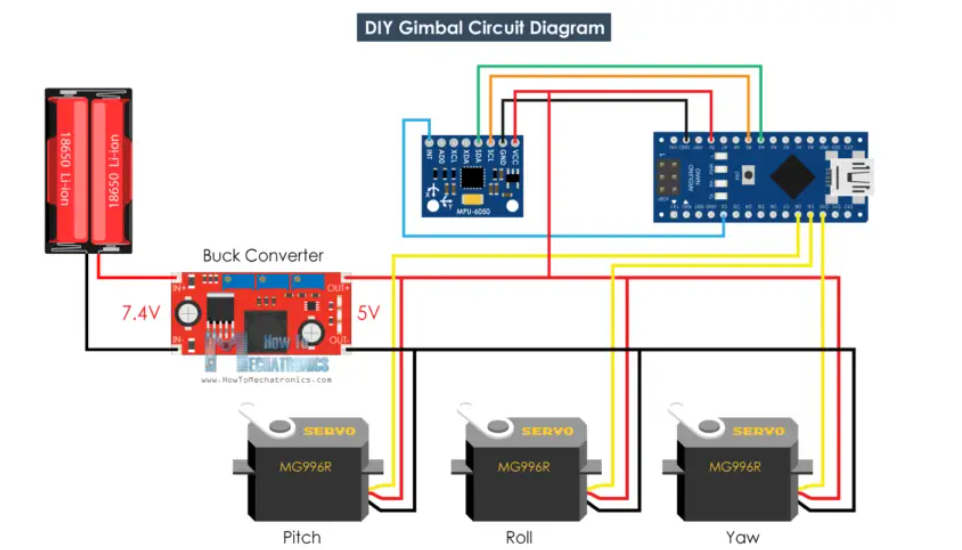

# Elektronik des Gimbal
## Einführung
Um die Elektronik des Gimbals zu implementieren, d.h. der Servomotor lenkt in die entgegengesetzte Richtung aus, wenn sich die Position des Objekts ändert, um eine Position des Objekts zu erreichen, die sich nicht mit dem Gimbal verändert.

In diesem Teil werden verschiedene Chiptypen (Arduino Nano und ESP8266) und drei-Achsen-Positionssensor (MPU650) zur Steuerung der Servomotoren verwendet. Der Steuercode wird in die verschiedenen Chiptypen geschrieben und der Sensor wird über Kabel mit den Chips verbunden. Um den ordnungsgemäßen Betrieb des Sensors zu gewährleisten, wird die Spannung der Batterie über den Buckconverter so eingestellt, dass an beiden Enden des Sensors die richtige Spannung anliegt.

Die wichtigsten Schritte sind wie folgt:
Auswahl der Chips: Für die Steuerung des Servomotors werden verschiedene Chiptypen verwendet. Zu diesen Chips gehören der Arduino Nano und der ESP8266, die beide über zahlreiche Funktionen verfügen und gut kompatibel sind.

Sensoranschluss: Der MPU650-Sensor wird über ein Kabel mit dem Chip verbunden. Die Hauptfunktion des Sensors ist es, genaue 3-Achsen-Lage- und Bewegungsdaten für die präzise Steuerung des Servomotors zu liefern.

Leistungsanpassung: Um den korrekten Betrieb des Sensors sicherzustellen, wird die Batteriespannung mit einem Buckconverter angepasst. Dadurch wird sichergestellt, dass der Sensor innerhalb des geeigneten Spannungsbereichs arbeitet, um genaue Daten zu liefern.

Schreiben des Steuercodes: Der für die Steuerung des Servomotors erforderliche Code wird in die verschiedenen Chiptypen geschrieben. Durch das Schreiben des entsprechenden Codes können die Position und die Bewegung des Servomotors auf der Grundlage der vom Sensor gelieferten Daten gesteuert werden.

Motoranschluss: Schließlich wird der Servomotor über ein Kabel an den Chip angeschlossen. Dadurch kann der Chip Steuersignale an den Motor senden, was eine präzise Steuerung des Servomotors ermöglicht.

Der spezifische Schaltplan sieht wie folgt aus:



<!---

Dont know how to fix - yet

```{image} ../images/Schaltungsplan.png
:alt: Platform
:class: bg-primary mb-1
:width: 250px
:align: center
```

-->

-------------
### Arduino Nano
Der Arduino Nano ist ein Open-Source-Breadboard-Mikrocontroller-Board, das auf dem Microchip ATmega328P-Mikrocontroller basiert.

 Der Arduino Nano kann mit der integrierten Entwicklungsumgebung (IDE) der Arduino-Software programmiert werden, die für alle Arduino-Boards gleich ist und sowohl online als auch offline läuft. 
### ESP8266 NodeMCU


## Der Funktionierte Teil 

## ESP8266 Steuerung des Servos

## ESP8266 Daten von der MPU6050 lesen

## Der nicht Funktionierte Teil 
DIY Arduino Gimbal - Self-Stabilizing Plaftorm Code von Arduino IDE kompiliert, kann erfolgreich in die ESP8266 Chip zu schreiben, aber das Servo nicht mit der Drehung des MPU6050 zu bewegen, und nicht die Funktion des Gimbal erreichen.
</br>
Es kann mehrere Gründe geben, warum die Funktion des Gimbals nicht erreicht wird.
Der Code basiert auf den Bibliotheken "I2Cdev" und "MPU6050_6Axis_MotionApps20", die möglicherweise nicht mit dem ESP8266 kompatibel sind. Es müssen Bibliotheken verwendet werden, die mit dem ESP8266 kompatibel sind und den Code entsprechend anpassen.Der ESP8266 kann im Vergleich zu Arduino-Boards begrenzte Ressourcen haben. Daher muss es sichergestellt, dass der Code und die Bibliotheken, die die verwendet werden, für die ESP8266-Plattform optimiert sind.

## Bibliotheks-Kompatibilität
Die MPU6050-Bibliothek, die speziell für den ESP8266 entwickelt wurde, zu suchen und zu verwenden. Dadurch wird sichergestellt, dass die Bibliothek mit dem ESP8266 kompatibel ist.</br>

Zum Beispiel erhältlich über folgenden link: [_ESP8266 MPU6050 library_](https://github.com/emanbuc/ESP8266_MPU6050) 
</br>
 Einige der darin enthaltenen Beispiele können als Referenz verwendet werden, um die darin enthaltenen Funktionen und Funktionen entsprechend zu modifizieren, damit sie mit dem MPU6050-Sensor kommunizieren und Daten verarbeiten können.
 </br>

Der ESP8266 liest Daten, indem er über das I2C-Protokoll Befehle an den MPU6050 sendet. Der MPU6050 speichert seine internen Beschleunigungs- und Gyroskopdaten in seinen FIFO-Puffern, die der ESP8266 dann über I2C auslesen kann. Diese Daten können vom ESP8266 verarbeitet und zur Steuerung der Bewegung des Gimbals verwendet werden. Daher ist eine I2C-Bibliothek, die für den ESP8266 angepasst werden kann, sehr wichtig. Eine solche Bibliothek ist beispielsweise die <Adafruit_MPU6050.h>, die im [_MPU6050_Display-Code_](https://randomnerdtutorials.com/esp8266-nodemcu-mpu-6050-accelerometer-gyroscope-arduino/)  verwendet wird.

## Entwicklung des Interruppt PINs
Das Design des Interrupt-Pins und die Verwendung der Interrupt-Handler-Funktion ermöglichen es dem ESP8266, die Verfügbarkeit der MPU6050-Daten rechtzeitig zu erfassen und sie sofort zu verarbeiten, wenn sie bereit sind. Dadurch wird eine effizientere und Echtzeit-Datenverarbeitung ermöglicht.
 </br>

Aber Einstellung Interrupt-Pins für die ESP8266 ist nicht das gleiche wie für den Arduino Nano.
</br>

In  `setup()` kann der Interrupt-Pin mit der Funktion `pinMode()` auf den Eingangsmodus konfiguriert werden.
```cpp
pinMode(2, INPUT);
```
Eine Interrupt-Callback-Funktion. 

Diese Funktion wird aufgerufen, wenn eine Interrupt ausgelöst wird, und wird für die Behandlung von Unterbrechungsereignissen verwendet.In diesem Code wird zum Beispiel eine Funktion `dmpDataReady()` definiert.Diese Funktion erkennt, ob neue Daten für den MPU6050 verfügbar sind.
```cpp
volatile bool mpuInterrupt = false;     // indicates whether MPU interrupt pin has gone high
void dmpDataReady() {
  mpuInterrupt = true;
}
```
In `setup()` wird die Funktion `attachInterrupt()` benutzt, um die Interrupt-Callback-Funktion(`dmpDataReady()`) mit einem Interrupt-Pin zu verknüpfen.Zum Beispiel wird der Interrupt-Pin GPIO2 (entspricht dem Digital Pin 2 des Arduino) mit der Callback-Funktion handleInterrupt() verknüpft, ausgelöst durch eine steigende Flanke.
```cpp
attachInterrupt(digitalPinToInterrupt(2), dmpDataReady, RISING);
```
Wenn die steigende Flanke des InterruptPins der MPU6050 ausgelöst wird, wird die Funktion `dmpDataReady()` aufgerufen. In dieser Funktion wird die Variable `mpuInterrupt` auf true gesetzt, was anzeigt, dass neue Daten verfügbar sind.